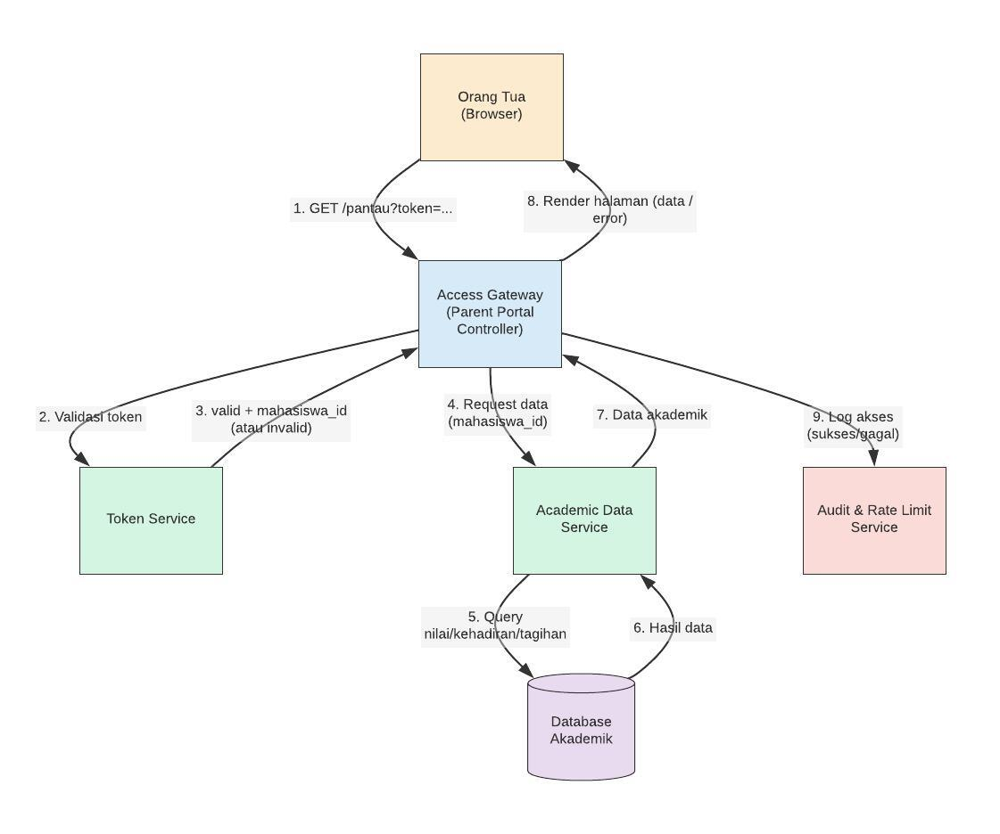

# SIPADU 

Sistem Pantau Akademik dirancang untuk memudahkan pemantauan perkembangan akademik mahasiswa secara transparan dan terintegrasi. Aplikasi ini bertujuan untuk memberikan akses informasi akademik yang cepat dan akurat bagi mahasiswa, orang tua, dan pihak administrasi perguruan tinggi guna mendukung proses pembelajaran dan evaluasi yang lebih efektif.

## Requirement
### Functional Requirement
| ID | Requirement | Alasan Prioritas |
|---|---|---|
|R1| **Admin dapat men-generate dan mencabut (revoke) token kapan saja** | Fondasi — tanpa ini tidak ada mekanisme akses sama sekali |
|R2| **Sistem membatasi jumlah percobaan akses per IP/token untuk mencegah penebakan token secara masif (brute force)** | Mekanisme Keamanan |
|R3| **Orang tua dapat melihat nilai, kehadiran, dan status tagihan mahasiswa tanpa membuat akun — cukup melalui tautan/token akses** | Inti dari SIPADU. |
|R4| **Sistem dapat menampilkan transkrip nilai mahasiswa** | Data akademik utama yang dibutuhkan baik admin, mahasiswa, maupun orang tua |
|R5| **Sistem dapat menampilkan total SKS yang sudah diampu mahasiswa** | Turunan langsung dari data transkrip (R4) |
|R6| **Dapat menampilkan status UKT mahasiswa** | - |
|R7| **Dapat menampilkan jadwal perkuliahan mahasiswa** | - |
|R8| **Tampilan dashboard disesuaikan dengan role (Admin dan User — Orang Tua & Mahasiswa)** | Lapisan UI/UX, bergantung pada R1–R7 sudah berjalan |
|R9| **Sistem harus menampilkan grafik perkembangan IPK/IPS mahasiswa dari semester ke semester** | Visualisasi |

### Non Functional Requirement
| ID | Requirement | Alasan Prioritas |
|---|---|---|
|NFR1| **Sistem dapat berjalan di mobile maupun desktop** | Krusial karena orang tua kemungkinan besar akses lewat tautan di HP |
|NFR2| **Sistem harus memiliki antarmuka yang sederhana dan mudah digunakan oleh pengguna** | Menentukan penerimaan pengguna non-teknis (orang tua) |
|NFR3| **Komponen antarmuka sistem harus dirancang secara modular dan dapat digunakan kembali** | KPenting untuk maintainability tim, tapi tidak langsung dirasakan pengguna akhir |

## Asumsi Tim
* Orang tua/wali merupakan pengguna utama sistem.
* Admin bertanggung jawab terhadap maintenance dan pengelolaan sistem, bukan sebagai sumber utama data akademik.
* Fakultas menjadi sumber data akademik seperti nilai, transkrip, dan data yang diperlukan untuk status UKT.
* Data yang ditampilkan sistem diasumsikan telah tersedia dan dapat diakses oleh backend.
* Distribusi token ke orang tua (lewat surat resmi, email, atau WhatsApp) berada di luar cakupan sistem ini — sistem hanya bertanggung jawab men-generate dan memvalidasi token.
* Akses yang diberikan bersifat read-only — tidak ada kebutuhan bagi orang tua untuk mengubah data apa pun.

## Modul dan Tanggung jawab
| Modul | Tanggung Jawab |
|---|---|
| *Audit & Rate Limit Service* | Mencatat setiap percobaan akses (sukses/gagal) ke log audit, serta membatasi jumlah request dari IP/token yang sama dalam rentang waktu tertentu |
| *Jadwal* | Menampilkan jadwal perkuliahan mahasiswa. |
| *UKT* | Menampilkan status pembayaran UKT mahasiswa. |
| *Academic Data* | Menyediakan transkrip nilai, perkembangan nilai, dan total SKS. |
| *Dashboard Akademik* | Menampilkan ringkasan informasi akademik sesuai role pengguna. |
| *Authentication & Role* | Login, autentikasi pengguna, dan pembatasan akses berdasarkan role. |

## Architecture

## Alur

## Peran Pengguna
* Orang Tua	: Memantau perkembangan akademik dan status pembayaran mahasiswa.
* Mahasiswa	: Melihat jadwal, transkrip nilai, dan informasi akademik secara berkala.
* Fakultas	: Menyediakan data akademik Mahasiswa
* Admin     : Melakukan maintenance dan mengelola sistem 

