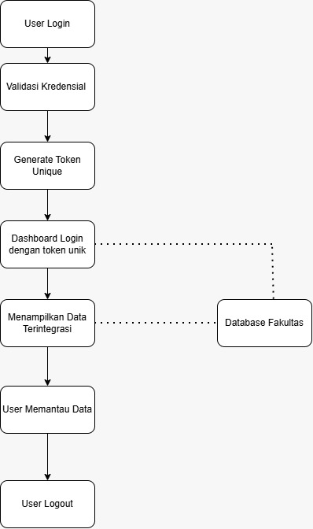

# SIPADU 

Sistem Pantau Akademik dirancang untuk memudahkan pemantauan perkembangan akademik mahasiswa secara transparan dan terintegrasi. Aplikasi ini bertujuan untuk memberikan akses informasi akademik yang cepat dan akurat bagi mahasiswa, orang tua, dan pihak administrasi perguruan tinggi guna mendukung proses pembelajaran dan evaluasi yang lebih efektif.

## Fitur Utama
* **Dashboard Utama	: Menampilkan IPK, IPS, total SKS yang diambil, serta grafik perkembangan nilai (progress bar/tren IP).**
* Transkrip Nilai		: Menyajikan rekapitulasi nilai seluruh mata kuliah yang telah ditempuh.
* Lulusan Terbaik	: Menampilkan daftar mahasiswa berprestasi dan lulusan terbaik. (TO BE CONSIDERED)
* Jadwal Perkuliahan	: Mengakses jadwal kuliah mingguan dan ujian. 
* Status UKT		: Informasi mengenai status pembayaran Uang Kuliah Tunggal.
* Pengumuman		: Pusat informasi terkini dari pihak kampus (opsional/dipertimbangkan).
* Informasi DPA		: Memberikan informasi dpa guna kemudahan konsultasi

## MODUL
Modul Dashboard untuk menampilkan transkrip nilai, jadwal perkuliahan, status UKT, grafik perkembangan nilai

## Peran Pengguna
Orang Tua	: Memantau perkembangan akademik dan status pembayaran mahasiswa.
Mahasiswa	: Melihat jadwal, transkrip nilai, dan informasi akademik secara berkala.
Fakultas	: Menyediakan data akademik Mahasiswa
Admin     : Melakukan maintenance dan mengelola sistem 

## Requirement

Functional Requirement :
*Sistem dapat menampilkan transkrip nilai Mahasiswa
* Sistem dapat menampilkan total SKS yang sudah diampu mahasiswa
* Dapat menampilkan Jadwal Perkuliahan Mahasiswa
* Dapat Menampilkan Status UKT Mahasiswa
* Tampilan Dashboard disesuaikan dengan role (Admin dan User (Orang tua dan Mahasiswa))
* Sistem harus menampilkan grafik perkembangan IPK/IPS mahasiswa dari semester ke semester

Non Functional Requirement :
* Sistem dapat berjalan di mobile maupun dekstop
* Sistem harus memiliki antarmuka yang sederhana dan mudah digunakan oleh pengguna
* Komponen antarmuka sistem harus dirancang secara modular dan dapat digunakan kembali.

